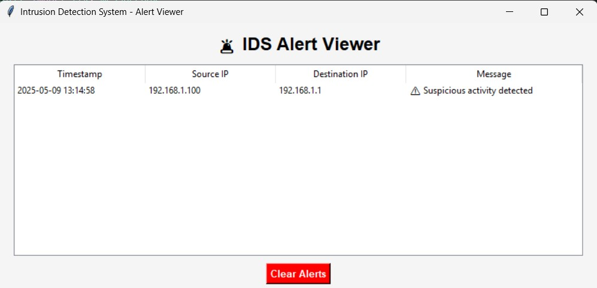

# 🚨 Intrusion Detection System (IDS)

This project is a lightweight **Intrusion Detection System** built using Python and Snort to monitor and detect suspicious network traffic.

---

## 📂 Project Structure

| File                  | Description                            |
|-----------------------|----------------------------------------|
| `main.py`             | Entry point for starting the IDS       |
| `sniffer.py`          | Sniffs packets using Scapy             |
| `snort_parser.py`     | Parses alerts generated by Snort       |
| `db_connect.py`       | Handles SQLite DB connection           |
| `alert_viewer_gui.py` | GUI to view intrusion alerts           |
| `snort_alerts.txt`    | Logs generated by Snort                |
| `.gitignore`          | Ignores unnecessary files              |

---

## 🛠️ Technologies Used

- Python
- Scapy
- Tkinter
- SQLite
- Snort IDS

---

## 🖼️ GUI Preview

Here’s a preview of the Intrusion Detection System’s alert viewer interface:

